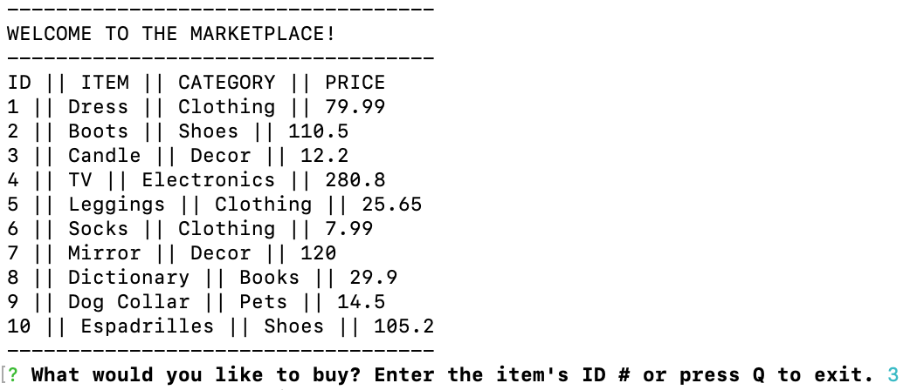
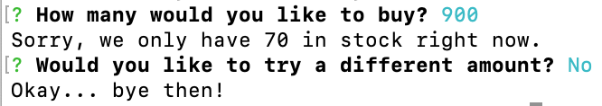
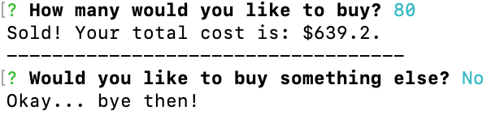
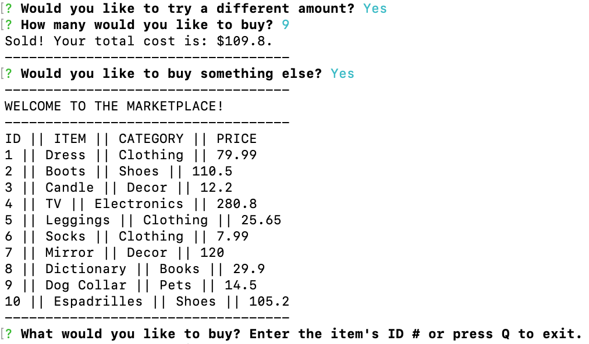

# Bamazon CLI App


#### APP DESCRIPTION
Bamazon is a command line node app that simulates an online store.  The app takes in orders from the user, and keeps track of/depletes stock from the store's inventory using MySQL and JavaScript.


* The GitHub repository can be found [here](https://github.com/carmel-m/Bamazon).

* A video walkthrough of the app can be found [here](https://drive.google.com/file/d/1Q8kU7SK83X6JicMMXlnezKfu6FUTSHQl/view?usp=sharing).


---

#### GETTING STARTED

1. Navigate to the root directory and type the following into the terminal:

``` shell
npm install
```

---

#### RUNNING THE APP

1. After launching the app, the user is presented with a list of all available items for sale, and they are prompted with a message asking for the ID of the product they want to buy:
    

2. After entering the ID, the user is prompted with a message asking how many they would like to buy.

3. If the user enters a number greater than the store has in stock, they will be notified of this and asked if they want to try a different amount.
    * Selecting `No` will display a goodbye message and will terminate the app.
    

    * Selecting `Yes` will display the quantity prompt again.
    

4. If the new quantity is less than the the quantity the store has in stock, the user will be shown a message with the total cost of the items purchased.  The user will then be asked if they would like to buy something else.
    * Selecting `No` will display a goodbye message and will terminate the app.
    

    * Selecting `Yes` will once again display the full list of items for sale and prompt the user to select an item for purchase.
    

---

#### LANGUAGES/FRAMEWORKS/TECHNOLOGIES:
* MySQL
* JavaScript
* Node.js
* Node packages - Inquirer, DotEnv, MySQL

---

#### AUTHOR:
Carmel Meyer

https://carmel-m.github.io/